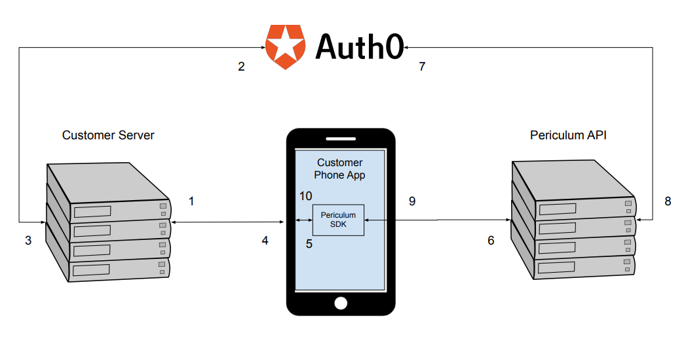

# react-native-periculum

Periculum library is a powerful & easy to use credit score library for Android.
The library gives you credit score information for your customer. No stress :)

## Badges
[](https://github.com/tterb/atomic-design-ui/blob/master/LICENSEs)

## Installation
Add react-native-periculum to your project by running;

Yarn

```bash
yarn add react-native-periculum
```
 NPM

```bash
npm install react-native-periculum
```

&nbsp;

## Info
You need to have a [periculum](https://www.periculum.io/) account for this plugin to work. And also install the following packages for the plugin to work perfectly.

* react-native-device-info
* react-native-get-location
* react-native-get-sms-android
* react-native-permissions

&nbsp;

## Android Permissions
Please make sure you add the following android permissions in your AndroidManifest.xml file
```bash
<uses-permission android:name="android.permission.READ_SMS" />
<uses-permission android:name="android.permission.WRITE_SMS" />
<uses-permission android:name="android.permission.SEND_SMS" />
<uses-permission android:name="android.permission.ACCESS_FINE_LOCATION"/>
<uses-permission android:name="android.permission.ACCESS_COARSE_LOCATION"/>
```
&nbsp;
## Usage periculum analytics

How to use the Periculum analytics method
```javascript
import React from 'react';
import {analytics} from 'react-native-periculum';

await analytics(authorization, statementName, customerMobile, customerBvn)
	.then(result => {
		console.log({result});
	})
	.catch(error => {
		console.log({error});
	});
```

## Periculum analytics parameters 
| Name | Description  | Type | Required |
| ------ | ------ |  ------ |  ------ |
| authorization  | Required. API access token generated from periculum api| String | Yes|
| statementName    | unique statement reference	| String | No |
| customerMobile   | Required. customer phone number | String | No |
| customerBvn   | customer bvn	| String | No |

&nbsp;
&nbsp;

## Usage periculum affordability

How to use the Periculum analytics method
```javascript
import React from 'react';
import {analytics} from 'react-native-periculum';

affordability(authorization, statementKey , dti, loanTenure).then(result => {
      console.log({result});
    })
    .catch(error => {
      console.log({error});
    })
```

## Periculum affordability parameters 
| Name | Description  | Type| Required |
| ---- | ------ | ------ | ------ |
| authorization  |  API access token generated from periculum api| String | Yes |
| statementKey    |  Unique statement reference	| int | Yes |
| dti | Debt to income ratio for the affordability analysis. | double (between 0-1)  | Yes |
| loanTenure    | The period of the loan in months.	 	| int | Yes |
| averageMonthlyTotalExpenses     |  Average Monthly Total Expenses 	| double | No |
| averageMonthlyLoanRepaymentAmount  | Average Monthly Loan Repayment Amount | double | No |

&nbsp;
## Authentication
To utilize any of Insights endpoints, your app is required to first identify and authorize itself against an authorization server by obtaining an access token.

To authenticate against the authorization server, you must ensure that you have received your app’s client_id and client_secret from Periculum. Without these, your app will be unable to obtain an access token and call endpoints on the Insights API. If you have not obtained your client_id or client_secret, then you should contact Periculum standard support channel (email support@periculum.io).



&nbsp;
## Contributing
Pull requests are welcome. For major changes, please open an issue first to discuss what you would like to change.

Please make sure to update tests as appropriate.

## License
[MIT](https://choosealicense.com/licenses/mit/)